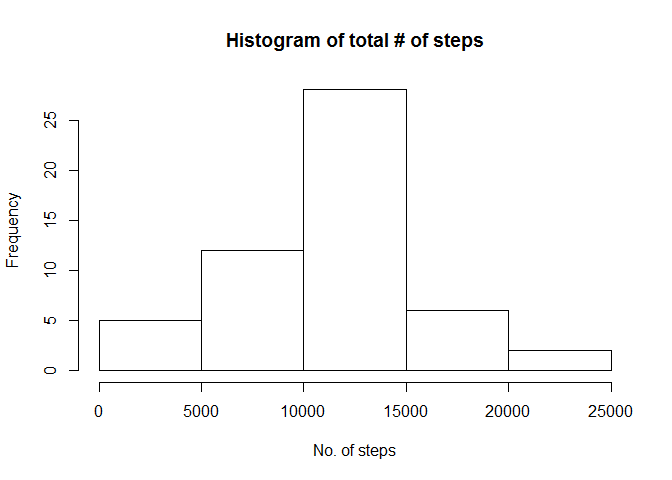
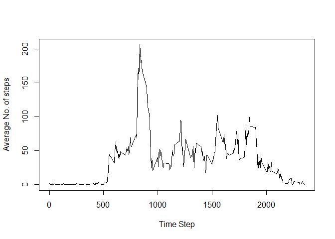
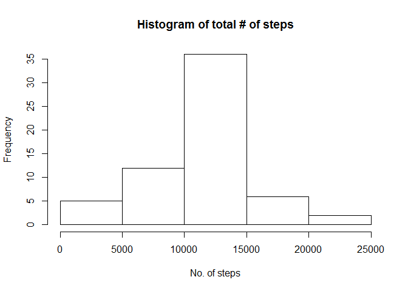
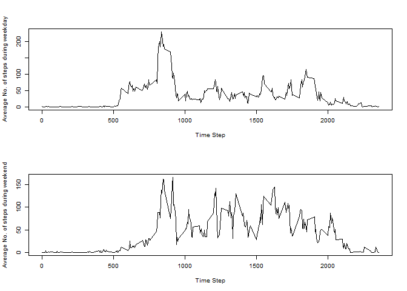

This is Peer assignment 1. The assignment is written in 4 parts. Each
part has its associated R code and its outputs. This file is created in
RStudio. Please see <http://rmarkdown.rstudio.com> for details.

<table>
<colgroup>
<col width="11%" />
</colgroup>
<tbody>
<tr class="odd">
<td align="left"><strong>Part 1 : Loading and preprocessing the activity data. Variables are described below </strong></td>
</tr>
<tr class="even">
<td align="left">data1 : Original Data read by R code</td>
</tr>
<tr class="odd">
<td align="left">stepSum : Subset of data which contains Sum of steps for each day of the month</td>
</tr>
<tr class="even">
<td align="left">stepAve : Subset of data which contains Average of steps for each 5-min. interval</td>
</tr>
</tbody>
</table>

    data1<-read.csv("activity.csv",header=TRUE)
    stepSum<-aggregate(data1$steps, by=list(Category=data1$date), FUN=sum)
    stepAve<-aggregate(data1$steps, by=list(Category=data1$interval), FUN=mean,na.rm=TRUE)

------------------------------------------------------------------------

**Part 2 : What is the mean total number of steps taken per day? **

------------------------------------------------------------------------

    meanX<-mean(stepSum$x,na.rm=TRUE)
    medianX<-median(stepSum$x,na.rm=TRUE)
    sprintf("Mean of Total # of Steps = %f", meanX)

    ## [1] "Mean of Total # of Steps = 10766.188679"

    sprintf("Median of Total # of Steps = %f", medianX)

    ## [1] "Median of Total # of Steps = 10765.000000"

    hist(stepSum$x,main=paste("Histogram of total # of steps"),xlab="No. of steps")

------------------------------------------------------------------------

**Part 3 : What is the average daily activity pattern? **

------------------------------------------------------------------------

    rowInd<-which.max(stepAve$x)
    TimeStepMax<-stepAve$Category[rowInd]
    sprintf("5-minute Time Step Interval Containing Max Time Step = %i", TimeStepMax)

    ## [1] "5-minute Time Step Interval Containing Max Time Step = 835"

    plot(stepAve$Category,stepAve$x,type="l",xlab="Time Step",ylab="Average No. of steps")

------------------------------------------------------------------------

**Part 4 : Imputing missing values **

Imputing strategy used is to replace each NA by the mean of its
corresponding 5-minute interval averaged overa all days

stepAveDay : Average \# of steps after Impute strategy

------------------------------------------------------------------------

    no_NA<-sum(is.na(data1$steps))
    stepAveDay<-aggregate(data1$steps, by=list(Category=data1$date), FUN=mean,rm.na=TRUE)

    Ind<-match(data1$interval,stepAve$Category)
    for(i in 1:nrow(data1)){
      if(is.na(data1$steps[i])) data1$steps[i]<-stepAve$x[Ind[i]]
    }
    stepSum1<-aggregate(data1$steps, by=list(Category=data1$date), FUN=sum)
    hist(stepSum1$x,main=paste("Histogram of total # of steps"),xlab="No. of steps")
    meanX_Imp<-mean(stepSum1$x,na.rm=TRUE)
    medianX_Imp<-median(stepSum1$x,na.rm=TRUE)
    sprintf("Mean of Total # of Steps = %f", meanX_Imp)

    ## [1] "Mean of Total # of Steps = 10766.188679"

    sprintf("Median of Total # of Steps = %f", medianX_Imp)

    ## [1] "Median of Total # of Steps = 10766.188679"

    hist(stepSum1$x,main=paste("Histogram of total # of steps"),xlab="No. of steps")

------------------------------------------------------------------------

**Part 5 : Are there differences in activity patterns between weekdays
and weekends? **

------------------------------------------------------------------------

    data1$date <- as.Date(data1$date)
    #create a vector of weekdays
    weekdays1 <- c('Monday', 'Tuesday', 'Wednesday', 'Thursday', 'Friday')
    #Use `%in%` and `weekdays` to create a logical vector
    #convert to `factor` and specify the `levels/labels`
    data1$wDay<-factor((weekdays(data1$date) %in% weekdays1),levels=c(FALSE, TRUE), labels=c('weekend', 'weekday')) 
    data1_Wkday<-subset(data1,wDay=='weekday')
    data1_Weekend<-subset(data1,wDay=='weekend')
    stepAve_Wkday<-aggregate(data1_Wkday$steps, by=list(Category=data1_Wkday$interval), FUN=mean,na.rm=TRUE)
    stepAve_Weekend<-aggregate(data1_Weekend$steps, by=list(Category=data1_Weekend$interval), FUN=mean,na.rm=TRUE)
    par(mfrow=c(2,1))
    par(cex=0.6)
    plot(stepAve_Wkday$Category,stepAve_Wkday$x,type="l",xlab="Time Step",ylab="Average No. of steps during weekday")
    plot(stepAve_Weekend$Category,stepAve_Weekend$x,type="l",xlab="Time Step",ylab="Average No. of steps during weekend")

